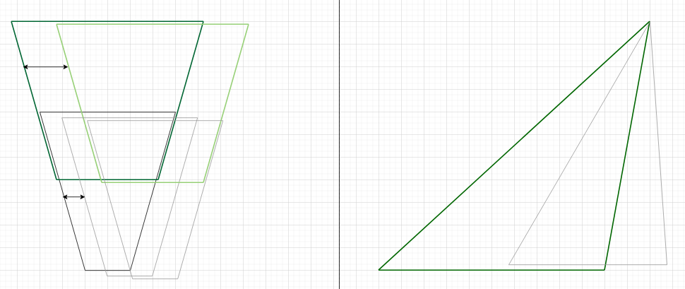
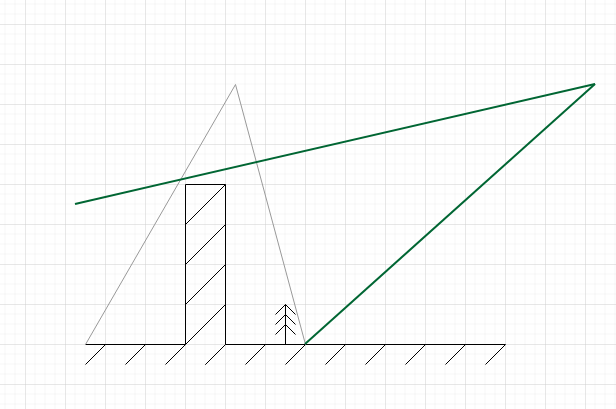
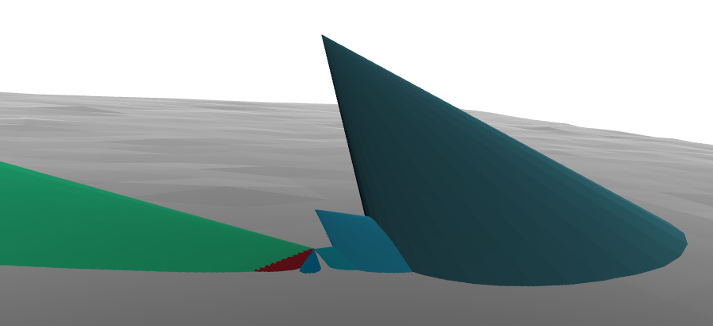

# Naive Cone Pairing Algorithm
**Jupyter-notebooks could be found in this repo https://github.com/aliaksandr960/opensfm_pairing_draft**

## Overview
Generally, it is just attempt to fix some edge cases. OpenSfM is the proven tool, which successfuly works for more than 10 years.

The image matching pipeline operates as follows: image pairs are initially selected based on metadata and then matched using point-matching algorithms such as SIFT, ORB, ALIKE, or others. There is an attempt to improve the image pairing process.

**In cases, when you have mix of nadir and oblique images, utilizing Field of View (FoV) cones could offer advantages over distance- or triangulation-based methods, which are already implemented in OpenSfM. But small advantages, don't expect a lot.**

**Field of view cones visualization**:

**Image matching for perspective aerial images in OpenSfM is also constrained by traditional computer vision algorithms such as SIFT and ORB. Most of these struggle with significant variations in scale, rotation, and perspective.**

Since I lack synthetic data generation pipelines or drones to test this hypothesis, the development has been published on GitHub as is. It has been a valuable self-education project.

Special thanks to @Komzpa and the OpenAerialMap community for their ideas, data, and support.

## Usage

### Setup
1. Install docker and git

2. Clone this repo and repo https://github.com/aliaksandr960/opensfm_pairing_draft 

3. Build the docker image by running **sh ./docker_build.sh**

4. Change paths in docker mounts in **./docker_start.sh** as you need

5. Run container by executing **sh ./docker_start.sh** 

6. Build OpenSfM by executing inside container **cd /source/OpenSfM && python setup.py build**

7. Run reconstruction by using **standard OpenSfM commands** or jupyter notebook **runner_notebook.ipynb** 

### Usage

1. Run container by executing **sh ./docker_start.sh** 

2. Build OpenSfM by executing inside container command **cd /source/OpenSfM && python setup.py build**

3. Your dataset should contain **config.yaml** to configure **OpenSfM pipelines and cone matching**

4. Run reconstruction by using **standard OpenSfM commands** or jupyter notebook **runner_notebook.ipynb** 

5. Make sure, due reconstruction there had been created **cones_projections.gpkg** file in dataset folder. It indicates - everything works well. You could inspect projections of cones to the surface by openning it in QGIS or other GIS software.

## config.yaml for the cone pairing
*Sample config file could be found in the root of this repo ./cones_config_example.yaml*

----

 **pair_selection_by_cones: bool** - to switch on pair selection by cones

**dem_path: string** - path to GeoTIF DEM in EPSG:4326 (only this projection supported). **DEM should cover only your area of interest**, kind a SRTM 90M 5km x 5km, don't put DEM of the whole country or whole world.

**dem_hight: float** - clips conuses by DEM and DEM extruded by this hight in meters

**pairing_fov: float** - conus angle in degrees (camera FOV) for pairing

=======
# Original OpenSfM Readme

## Overvie
OpenSfM is a Structure from Motion library written in Python. The library serves as a processing pipeline for reconstructing camera poses and 3D scenes from multiple images. It consists of basic modules for Structure from Motion (feature detection/matching, minimal solvers) with a focus on building a robust and scalable reconstruction pipeline. It also integrates external sensor (e.g. GPS, accelerometer) measurements for geographical alignment and robustness. A JavaScript viewer is provided to preview the models and debug the pipeline.

  

Checkout this [blog post with more demos](http://blog.mapillary.com/update/2014/12/15/sfm-preview.html)

## Getting Started

* [Building the library][]
* [Running a reconstruction][]
* [Documentation][]

[Building the library]: https://opensfm.org/docs/building.html (OpenSfM building instructions)
[Running a reconstruction]: https://opensfm.org/docs/using.html (OpenSfM usage)
[Documentation]: https://opensfm.org/docs/ (OpenSfM documentation)

## License
OpenSfM is BSD-style licensed, as found in the LICENSE file.  See also the Facebook Open Source [Terms of Use][] and [Privacy Policy][]

[Terms of Use]: https://opensource.facebook.com/legal/terms (Facebook Open Source - Terms of Use)
[Privacy Policy]: https://opensource.facebook.com/legal/privacy (Facebook Open Source - Privacy Policy)
