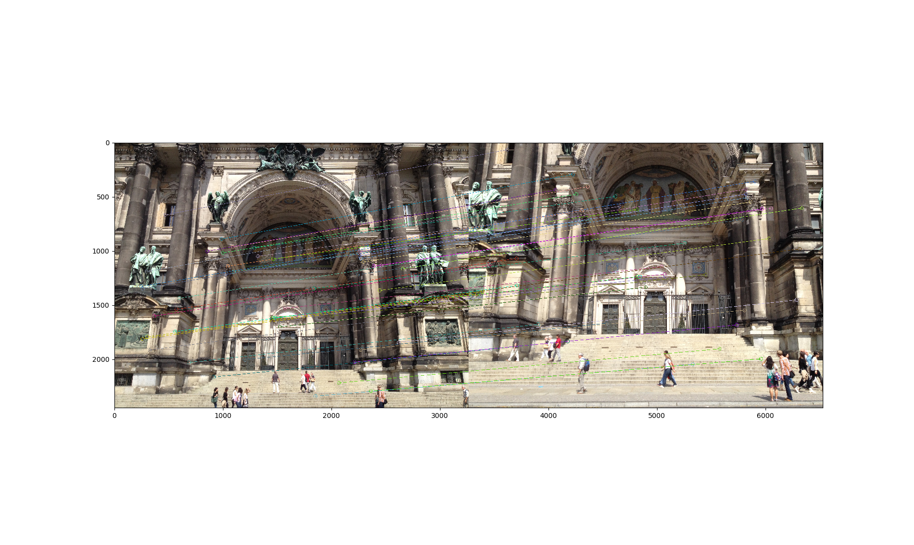
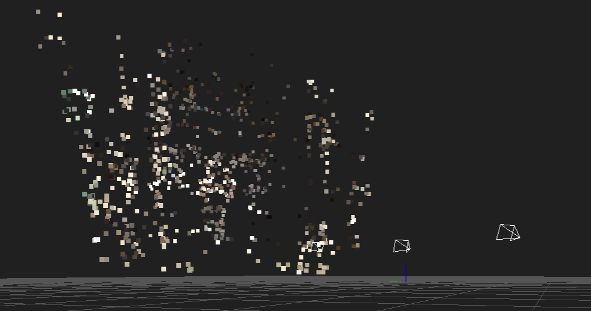

OpenSfM [](https://travis-ci.org/mapillary/OpenSfM)
=======

## Overview
OpenSfM is a Structure from Motion library written in Python. The library serves as a processing pipeline for reconstructing camera poses and 3D scenes from multiple images. It consists of basic modules for Structure from Motion (feature detection/matching, minimal solvers) with a focus on building a robust and scalable reconstruction pipeline. It also integrates external sensor (e.g. GPS, accelerometer) measurements for geographical alignment and robustness. A JavaScript viewer is provided to preview the models and debug the pipeline.

<p align="center">
  
</p>

Checkout this [blog post with more demos](http://blog.mapillary.com/update/2014/12/15/sfm-preview.html)


## Getting Started

* [Building the library][]
* [Running a reconstruction][]
* [Documentation][]


[Building the library]: https://docs.opensfm.org/building.html (OpenSfM building instructions)
[Running a reconstruction]: https://docs.opensfm.org/using.html (OpenSfM usage)
[Documentation]: https://docs.opensfm.org  (OpenSfM documentation)

## Update Sift_GPU version

### Changes:
* added SIFT_GPU parameters to the config file.
* added SiftGPU class.
* added feature detection function in features.py file.
* added matching functions to the matching.py file.
* changed the commands to support the sift_gpu option.
* added functions to of save and load sift_gpu keypoints to the dataset.py file.
 


### Requirements:
This update depends on the silx python package.

To install it you will need to install pyopencl.
Please see the installation guide [Here](http://www.silx.org/doc/silx/dev/install.html).

### Usage
In order to test if all the packages were installed correctly. Try to run my test code. 
Which match two of the images in the Berlin data. The code can be found in the main folder under the name "test_sift_gpu.py".

To run this Code simply write:
```
cd OpenSfm_sift_gpu
python test_sift_gpu.py
```
### Run OpenSfm

If all the dependencies were installed correctly.
To run the opensfm pipeline enter this commands:
```
cd OpenSfm_sift_gpu
./bin/opensfm_run_all data/berlin_gpu
```

To check the sfm, enter:

`python3 -m http.server`

and click on this [link](http://localhost:8000/viewer/reconstruction.html#file=/data/berlin_gpu/reconstruction.meshed.json) to see the reconstruction. 

### Benchmark
Here you can see the results of the Sift_GPU implementation.

#### Feature detection
<p align="center">
  
  
</p>


<p align="center">
  
  
</p>

#### Feature Matching

<p align="center">
  
</p>
  
<p align="center">
  
</p>

#### SFM Creation

 <p align="center">
  
</p>
  
<p align="center">
  
</p>

#### Speed
Feature Matching on image (3264x2448) on 1080-TI-GTX took 0.28 sec

Feature Matching took 0.025 sec

#### Contact Me

For more information, you can contact me via [Email](mailto:cojosef@gmail.com)

