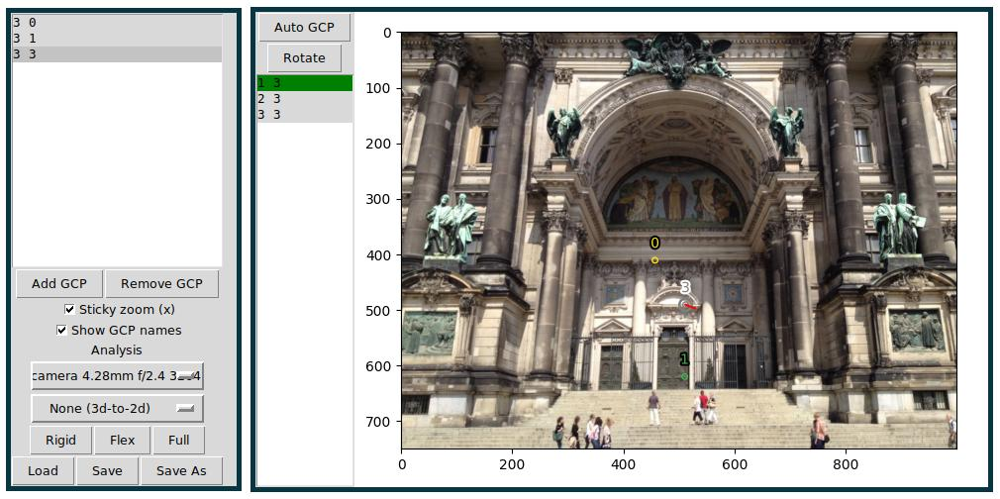
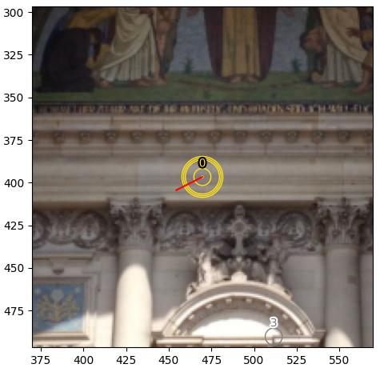
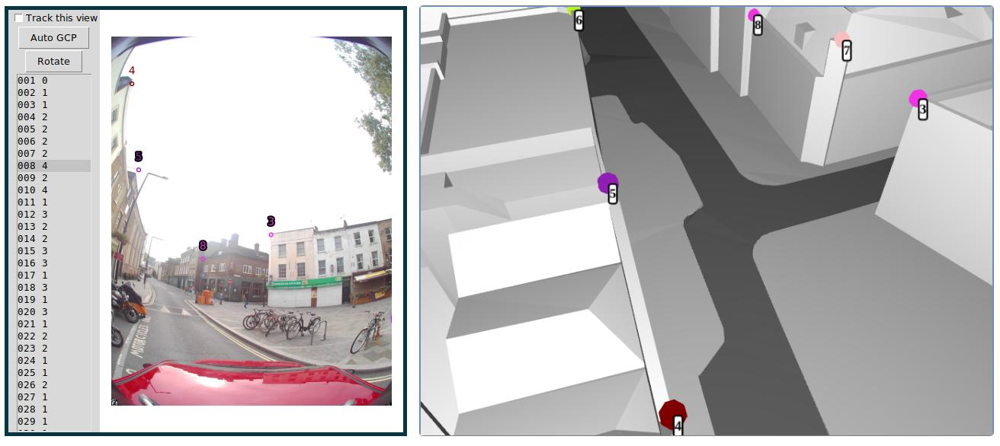

Control points annotation tool
==============================

The usage of control points during the reconstruction process in OpenSfM is documented
`here <using.html#ground-control-points>`_.
This page deals with a graphical user interface to create control points manually.

The typical use case of this tool is to annotate the pixel locations surveyed ground control points
on 2D images so that they can be used during the reconstruction phase for accurate georegistration.

Other less common use cases are also made possible with control points and can be realized with this tool,
some of these are discussed at the end of this page:

- Annotating pseudo-ground control points on orthophotos.
- Annotating correspondences between two reconstructions that can't be matched automatically.
  (e.g. one created during the day and another one during the night, summer-winter, and so on).
- Annotating correspondences between 2D images and a 3D CAD model.

Besides annotating control points, the tool also includes features to check for correctness
in the annotation by reporting and visualizing reprojection errors.

Setup
-----

Ensure that you python installation includes tk.
Check by running the following command, which should return silently::

    python3 -c "import tkinter"

Install requirements::

    cd OpenSfM
    pip install -r annotation_gui_gcp/requirements.txt

Launch the UI on a sample dataset::

    python annotation_gui_gcp/main.py data/berlin

Layout
------

The tool is a multi-window application:
There is a main toolbox and one or more windows to interact with images.
The number of windows depends on the contents of the sequence_database.json file.
This file defines one or more image sequences. Each sequence will open in a new window.
The example dataset at ``data/berlin`` contains a single sequence in
`sequence_database.json <https://github.com/mapillary/OpenSfM/blob/master/data/berlin/sequence_database.json>`_

Main toolbox
~~~~~~~~~~~~

The main toolbox contains the list of existing control points as well as several controls.
The basic controls are explained here. Scroll to :ref:`additional-controls` for information on the rest.

- The 'Load', 'Save' and 'Save As' buttons save and load the ground control points into a file with :ref:`json-gcps`.
- If there is a ``ground_control_points.json`` file in the dataset directory, it will be loaded upon launch.
- Control points can be added or removed with the 'Add GCP' and 'Remove GCP' buttons, and the active point is highlighted in green.
- By selecting a point in the list it becomes active and can be annotated on an image. 

Image view
~~~~~~~~~~

Each Image view displays a sequence of images as defined in the ``sequence_database.json`` file.
The view allows navigating through the sequence and creating, deleting and correcting control points on each image.
The panel on the left contains a list of frames and a button to rotate images.

Basic controls:

- Clicking on a frame on the frame list will display that image.
- Scrolling up/down with the mouse wheel or the up/down arrows will move to the next/previous frame.
- Left clicking will create or update a control point annotation for the currently selected control point (on the main toolbox)
- Right clicking will remove the control point annotation on this image.

Usage
-----

Basic workflow
~~~~~~~~~~~~~~

Assuming that you have a set of ground control points whose geodetic coordinates you know:

1. Create a OpenSfM dataset containing your images under images/ and their order in a ``sequence_database.json`` file.
   You can use ``data/berlin`` for this example.
2. Generate a ``ground_control_points.json`` file with all your measured ground control points and place it in the root of the dataset
   See the example below. Note how the 'observations' is empty as we will generate those using the annotation tool.
::

    "points": [
      {
        "position": {"latitude": 52.519,"altitude": 14.946,"longitude": 13.400},
        "id": "my_measured_gcp_1",
        "observations": []
      }
    ]
3. Launch the annotation tool, note how the GCP list contains your ground control points.
4. Scroll through all the images, annotating each GCP on all the locations where it is visible.
5. Click on 'save' so overwrite the ``ground_control_points.json`` file with your annotations.
   The annotated ground control points can now be used in the OpenSfM reconstruction pipeline,
   see the relevant docs `here <using.html#ground-control-points>`_.

.. _running-alignment:

Running the alignment and detecting wrong annotations
~~~~~~~~~~~~~~~~~~~~~~~~~~~~~~~~~~~~~~~~~~~~~~~~~~~~~

After annotating a point in more than two images, it can be triangulated using known camera poses.
The reprojection of the triangulated points onto the images can be used as a check that the annotations
are correct. This is enabled by the Analysis section in the main toolbox.

1. Ensure that there is a reconstruction.json file in the ``data/berlin`` directory.
   (see `this <using.html#ground-control-points>`_ link for instructions on that).
2. Annotate a control point in at least three images.
3. Save the control points using the 'Save' button.
4. Click on 'Rigid'. After a moment, you will see red lines connecting the projection of the triangulated
   coordinate with the annotations. A large line might indicate an annotation mistake as seen here:

If there are many control points, visually inspecting the results might be slow. On the terminal
you will find summarized statistics about the quality of the annotations.

After running the analysis, the output aligned reconstructions are saved with new filenames in the root
folder and can be viewed in 3D with the OpenSfM viewer.

The 'Flex' and 'Full' buttons produce additional analysis results and
are explained in :ref:`two-reconstruction-annotation`

Advanced features
-----------------

Sticky zoom
~~~~~~~~~~~

If enabled (by ticking the corresponding checkbox in the toolbox), 
the view will automatically zoom in to the active control point
when a new image is loaded and the point is annotated in that image.

This is useful to check the precision of a control point on many
consecutive images easily.

If the point is not annotated in the image, the view will also zoom
in to the approximate expected location of the control point on the new image.
This is useful to efficiently annotate a control point in consecutive images.

.. _annotation-tool-rig-support:

Rig support
~~~~~~~~~~~

Rig support is transparent, as long as the rigs are in the format that OpenSfM expects:
a ``rig_assignments.json`` file should be at the root of the dataset (:ref:`rig-model`).

If a dataset with rig images is opened, each camera in the rig will have its own window.
After navigating to an image in any of the windows of the rig, all the other windows will automatically
display the corresponding image.

.. _additional-controls:
Additional controls
~~~~~~~~~~~~~~~~~~~

**Main toolbox**

- 'Show GCP names': if active, the labels for all the points in an image are shown.
  When inactive, only the label for the active point is shown.
- 'Sticky zoom': if active, automatically zooms into an existing annotation of the active point after loading an image.

**Image views**

- Pressing the mousewheel will toggle zoom.

**Global hotkeys**

- 'a' will, on every image window, jump to an image where the currently selected control point is annotated.
- 'x' will enable or disable the 'sticky zoom' feature
- 'z' will zoom in or out of all views.
- 'q' will display the annotation with the largest reprojection error

.. _orthophoto-annotation:

Annotating orthophotos
~~~~~~~~~~~~~~~~~~~~~~

Orthophotos can be used to assign geodetic coordinates to a control point as a fallback for actual measurements.
Detailed documentation for this is not available as the feature is experimental, but, in short:

- Ensure that your images contain metadata about their GPS location.
  This is used to show the relevant location on the orthophotos.

- Use the --ortho argument when launching the UI to indicate a directory containing
  georeferenced orthophoto tiles in ``.geotiff`` format.

- After launching, tick the 'track this view' checkbox on a window containing the ground-level images. 
  Then, the orthophoto window will only display images on its list that depict the location of the ground-level images.

- Using the reference of the geotiff files, the clicked pixel coordinates will be converted to geodetic coordinates
  and saved in the ground_control_points.json file as latitude, longitude, altitude

.. _two-reconstruction-annotation:

Aligning two reconstructions
~~~~~~~~~~~~~~~~~~~~~~~~~~~~

The tool can be used to align two reconstructions that were not reconstructed together for whatever reason
(e.g. day and night or winter and summer images)

Detailed documentation for this is not available as the feature is experimental, but, in short:

- Start from a dataset containing more than one reconstruction in ``reconstruction.json``.

- Launch the tool:
    - If the two reconstructions come from different sequences, lauch as usual.
    - If the two reconstructions come from the same sequence, launch using the ``--group-by-reconstruction`` argument.
      This will split the images into two windows, one for each reconstruction.

- Find control points in common and annotate them.
  Make sure to annotate enough points to constrain the alignment.

Use the 'Rigid', 'Flex' or 'Full' buttons to run the alignment using the annotations:

- The 'Rigid' option triangulates the control points in each reconstruction independently and finds a rigid transform to align them.
- The 'Flex' option additionally re-runs bundle adjustment, allowing for some deformation of both reconstructions to fit the annotations.
- The 'Full' option attempts to obtain positional covariances for each camera pose.
  If succesful, the frame list on the image views is populated with the positional covariance norm. Lower is better.

After running analysis, the reprojection errors are overlaid on the image views as shown in :ref:`running-alignment`.
The aligned reconstructions are saved with new filenames in the root folder and can be viewed in 3D with the OpenSfM viewer.

About **Auto GCP**: This button can be used for the two-reconstruction case. When clicked on an image view,
it will display all the 3D points belonging to the corresponding reconstruction.
After clicking on any of the displayed points, a GCP will be automatically created
and partially annotated by copying the point's projections.
This reduces work as now you only have to annotate on the other reconstruction.

.. _cad-model-annotation:

Annotating CAD models
~~~~~~~~~~~~~~~~~~~~~

3D models in .FBX format can also be annotated with this tool.

The behavior is similar to the orthophoto annotation: the GPS coordinates of the ground-level images
are used to pick from a collection of models. Annotations are 3D instead of 2D and can be used to align
the SfM reconstruction with the CAD models.

This is highly experimental at the moment. Check out the --cad argument and the files in
`cad_viewer <https://github.com/mapillary/OpenSfM/blob/feat_annotation_ui/annotation_gui_gcp/cad_viewer>`_
for more information and/or get in touch.

