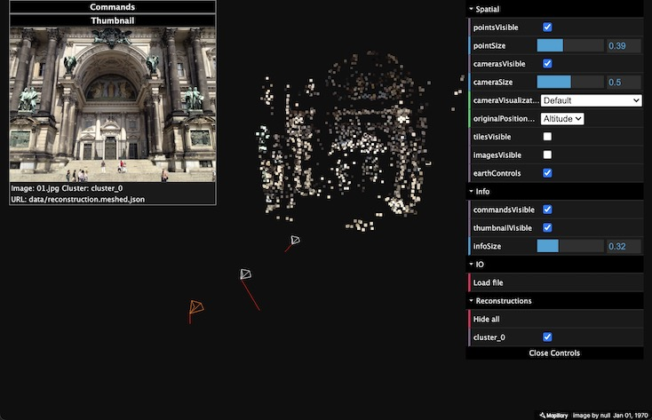

.. Notes and doc on dense matching


Using
=====


Quickstart
----------

An example dataset is available at ``data/berlin``.  You can reconstruct it using by running::

    bin/opensfm_run_all data/berlin

This will run the entire SfM pipeline and produce the file ``data/berlin/reconstruction.meshed.json`` as output. To visualize the result you can start a HTTP server running::

    python -m SimpleHTTPServer

and then browse `<http://localhost:8000/viewer/reconstruction.html#file=/data/berlin/reconstruction.meshed.json>`_
You should see something like



You can click twice on an image to see it.  Then use arrows to move between images.

If you want to get a denser point cloud, you can run::

    bin/opensfm undistort data/berlin
    bin/opensfm compute_depthmaps data/berlin

This will run dense multiview stereo matching and produce a denser point cloud stored in ``data/berlin/depthmaps/merged.ply``.  You can visualize that point cloud using MeshLab_ or any other viewer that supports PLY_ files.

For the Berlin dataset you should get something similar to this

.. image:: images/berlin_point_cloud.jpg


To reconstruct your own images,

1. put some images in ``data/DATASET_NAME/images/``, and
2. copy ``data/berlin/config.yaml` to ``data/DATASET_NAME/config.yaml``


.. _Meshlab: http://www.meshlab.net/
.. _PLY: http://paulbourke.net/dataformats/ply/


Reconstruction Commands
-----------------------

There are several steps required to do a 3D reconstruction including feature detection, matching, SfM reconstruction and dense matching.  OpenSfM performs these steps using different commands that store the results into files for other commands to use.

The single application ``bin/opensfm`` is used to run those commands.  The first argument of the application is the command to run and the second one is the dataset to run the commands on.

Here is the usage page of ``bin/opensfm``, which lists the available commands::

    usage: opensfm [-h] command ...

    positional arguments:
      command            Command to run
        extract_metadata
                         Extract metadata form images' EXIF tag
        detect_features  Compute features for all images
        match_features   Match features between image pairs
        create_tracks    Link matches pair-wise matches into tracks
        reconstruct      Compute the reconstruction
        mesh             Add delaunay meshes to the reconstruction
        undistort        Save radially undistorted images
        compute_depthmaps
                         Compute depthmap
        export_ply       Export reconstruction to PLY format
        export_openmvs   Export reconstruction to openMVS format
        export_visualsfm
                         Export reconstruction to NVM_V3 format from VisualSfM

    optional arguments:
      -h, --help         show this help message and exit


extract_metadata
````````````````

This commands extracts EXIF metadata from the images an stores them in the ``exif`` folder and the ``camera_models.json`` file.

The following data is extracted for each image:

- ``width`` and ``height``: image size in pixels

- ``gps`` ``latitude``, ``longitude``, ``altitude`` and ``dop``: The GPS coordinates of the camera at capture time and the corresponding Degree Of Precission).  This is used to geolocate the reconstruction.

- ``capture_time``: The capture time. Used to choose candidate matching images when the option ``matching_time_neighbors`` is set.

- ``camera orientation``: The EXIF orientation tag (see this `exif orientation documentation`_).  Used to orient the reconstruction straigh up.

- ``projection_type``: The camera projection type.  It is extracted from the GPano_ metadata and used to determine which projection to use for each camera.  Supported types are `perspective`, `equirectangular` and `fisheye`.

- ``focal_ratio``: The focal length provided by the EXIF metadata divided by the sensor width. This is used as initialization and prior for the camera focal length parameter.

- ``make`` and ``model``: The camera make and model.  Used to build the camera ID.

- ``camera``: The camera ID string. Used to identify a camera. When multiple images have the same camera ID string, they will be assumed to be taken with the same camera and will share its parameters.


Once the metadata for all images has been extracted, a list of camera models is created and stored in ``camera_models.json``.  A camera is created for each diferent camera ID string found on the images.

For each camera the following data is stored:

- ``width`` and ``height``: image size in pixels
- ``projection_type``:  the camera projection type
- ``focal``:  The initial estimation of the focal length (as a multiple of the sensor width).
- ``k1`` and ``k2``:  The initial estimation of the radial distortion parameters. Only used for `perspective` and `fisheye` projection models.
- ``focal_prior``: The focal length prior.  The final estimated focal length will be forced to be similar to it.
- ``k1_prior`` and ``k2_prior``:  The radial distortion parameters prior.


Providing your own camera parameters
''''''''''''''''''''''''''''''''''''

By default, the camera parameters are taken from the EXIF metadata but it is also possible to override the default parameters.  To do so, place a file named ``camera_models_overrides.json`` in the project folder.  This file should have the same structure as ``camera_models.json``.  When running the ``extract_metadata`` command, the parameters of any camera present in the ``camera_models_overrides.json`` file will be copied to ``camera_models.json`` overriding the default ones.

Simplest way to create the ``camera_models_overrides.json`` file is to rename ``camera_models.json`` and modify the parameters.  You will need to rerun the ``extract_metadata`` command after that.

Here is a `spherical 360 images dataset`_ example using ``camera_models_overrides.json`` to specify that the camera is taking 360 equirectangular images.


.. _`exif orientation documentation`: http://sylvana.net/jpegcrop/exif_orientation.html
.. _GPano: https://developers.google.com/streetview/spherical-metadata
.. _`spherical 360 images dataset`: https://www.dropbox.com/sh/3vabbmrhqqbagp5/AABi14O2tWMbxAX91jaaQY77a?dl=0

detect_features
```````````````
This command detect feature points in the images and stores them in the `feature` folder.


match_features
``````````````
This command matches feature points between images and stores them in the `matches` folder.  It first determines the list of image pairs to run, and then run the matching process for each pair to find corresponding feature points.

Since there are a lot of possible image pairs, the process can be very slow.  It can be speeded up by restricting the list of pairs to match.  The pairs can be restricted by GPS distance, capture time or file name order.


create_tracks
`````````````
This command links the matches between pairs of images to build feature point tracks.  The tracks are stored in the `tracks.csv` file.  A track is a set of feature points from different images that have been recognized to correspond to the same pysical point.


reconstruct
```````````
This command runs the incremental reconstruction process.  The goal of the reconstruction process is to find the 3D position of tracks (the `structure`) together with the position of the cameras (the `motion`).  The computed reconstruction is stored in the ``reconstruction.json`` file.


mesh
````
This process computes a rough triangular mesh of the scene seen by each images.  Such mesh is used for simulating smooth motions between images in the web viewer.  The reconstruction with the mesh added is stored in ``reconstruction.meshed.json`` file.

Note that the only difference between ``reconstruction.json`` and ``reconstruction.meshed.json`` is that the later contains the triangular meshes.  If you don't need that, you only need the former file and there's no need to run this command.


undistort
`````````
This command creates undistorted version of the reconstruction, tracks and images.  The undistorted version can later be used for computing depth maps.


compute_depthmaps
`````````````````
This commands computes a dense point cloud of the scene by computing and merging depthmaps.  It requires an undistorted reconstructions.  The resulting depthmaps are stored in the ``depthmaps`` folder and the merged point cloud is stored in ``depthmaps/merged.ply``


Configuration
-------------

TODO explain config.yaml and the available parameters


.. include:: gcp.rst
